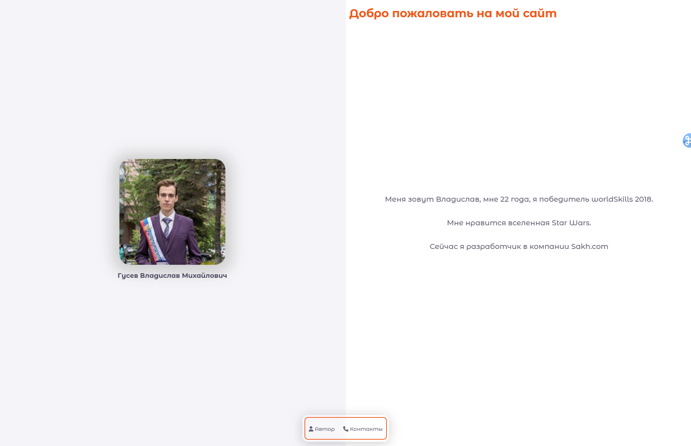
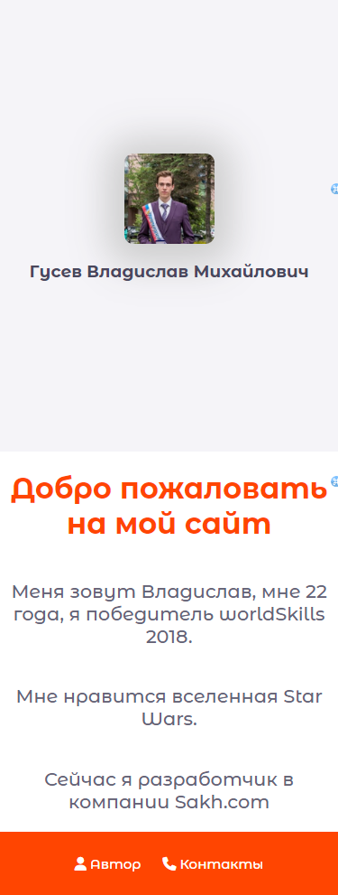

<p align = "center">МИНИСТЕРСТВО НАУКИ И ВЫСШЕГО ОБРАЗОВАНИЯ<br>
РОССИЙСКОЙ ФЕДЕРАЦИИ<br>
ФЕДЕРАЛЬНОЕ ГОСУДАРСТВЕННОЕ БЮДЖЕТНОЕ<br>
ОБРАЗОВАТЕЛЬНОЕ УЧРЕЖДЕНИЕ ВЫСШЕГО ОБРАЗОВАНИЯ<br>
«САХАЛИНСКИЙ ГОСУДАРСТВЕННЫЙ УНИВЕРСИТЕТ»</p>
<br><br><br><br><br><br>
<p align = "center">Институт естественных наук и техносферной безопасности<br>Кафедра информатики<br>Гусев Владислав Михайлович</p>
<br><br><br>
<p align = "center"><br><strong>Лабораторная работа №1.«Введение вэб-разработку»</strong><br>01.03.02 Прикладная математика и информатика</p>
<br><br><br><br><br><br><br><br><br><br><br><br>
<p align = "right">Научный руководитель<br>
Соболев Евгений Игоревич</p>
<br><br><br>
<p align = "center">г. Южно-Сахалинск<br>2024 г.</p>
<br><br><br><br><br><br><br><br><br><br><br><br>

<h1 align = "center">Введение</h1>

<p><b>HTML</b> —  стандартизированный язык гипертекстовой разметки документов для просмотра веб-страниц в браузере. Веб-браузеры получают HTML документ от сервера по протоколам HTTP/HTTPS или открывают с локального диска, далее интерпретируют код в интерфейс, который будет отображаться на экране монитора.</p>
<p><b>CSS</b> — формальный язык описания внешнего вида документа, написанного с использованием языка разметки. Также может применяться к любым XML-документам, например, к SVG или XUL.</p>


<h1 align = "center">Задачи</h1>


<p>Создать простую страницу о себе, страница должна включать информацию о вас, возраст, достижения, фотографию или фотографии вас, информацию о вашем о хобби и.т.д</p>


<h1 align = "center">Решение</h1>

<h2 align = "center">Файл index.html</h2>

```html
<!DOCTYPE html>
<html lang="en">
<head>
    <meta charset="UTF-8">
    <title>О себе</title>
    <meta name="viewport" content="width=device-width, initial-scale=1">
    <link href="style/style.css" rel="stylesheet">
    <link href="style/cards-about.css" rel="stylesheet">
    <link href="style/navbar.css" rel="stylesheet">
    <link rel="preconnect" href="https://fonts.googleapis.com">
    <link rel="preconnect" href="https://fonts.gstatic.com" crossorigin>
    <link href="https://fonts.googleapis.com/css2?family=Montserrat+Alternates:ital,wght@0,100;0,200;0,300;0,400;0,500;0,600;0,700;0,800;0,900;1,100;1,200;1,300;1,400;1,500;1,600;1,700;1,800;1,900&display=swap"
          rel="stylesheet">
    <link href="https://cdnjs.cloudflare.com/ajax/libs/font-awesome/6.5.1/css/all.min.css" rel="stylesheet">
</head>
<body>
<div class="cards-about">
    <div class="cards-about__card-about cards-about__card-about_left">
        <div class="card-about__container card-about__container_center">
            
            <h3 class="text-dark">Гусев Владислав Михайлович</h3>
        </div>
    </div>
    <div class="cards-about__card-about cards-about__card-about_right">
        <div class="cards-about__text-welcome text-orange">
            <h1>Добро пожаловать на мой сайт</h1>
        </div>
        <div class="card-about__container card-about__container_center">
            <p class="text-content">
                Меня зовут Владислав, мне 22 года, я победитель worldSkills 2018.
            </p>
            <p class="text-content">
                Мне нравится вселенная Star Wars.
            </p>
            <p class="text-content">Сейчас я разработчик в компании Sakh.com</p>
        </div>
    </div>
</div>
<div class="navbar navbar_center navbar_bottom">
    <div class="navbar__container">
        <ul class="navbar__list">
            <li class="navbar__item-container text-content">
                <div class="navbar__item">
                    <i class="fa-solid fa-user"></i> Автор
                    <a href="#/author.html"></a>
                </div>
            </li>
            <li class="navbar__item-container text-content">
                <div class="navbar__item">
                    <i class="fa-solid fa-phone"></i> Контакты
                    <a href="#/contacts.html"></a>
                </div>

            </li>
        </ul>
    </div>
</div>
</body>
</html>
```
<h2 align = "center">Файл style.css</h2>

```css
body {
    width: 100%;
    height: 100%;
    margin: 0;
    font-family: "Montserrat Alternates", sans-serif;
    font-weight: 100;
    font-style: normal;
    color: #666276ff;
}

.text-content {
    font-size: 1.3em;
    color: #666276ff;
    font-weight: 500;
}

.text-orange {
    color:orangered;
}
.text-dark {
    color: #4b475c;
}
.text-400 {
    font-weight: 400;
}
```

<h2 align = "center">Файл cards-about.css</h2>

```css
.cards-about {
    display: flex;
    flex-direction: row;
    height: 100vh;
}

.cards-about__card-about {
    display: flex;
    flex-direction: column;
    width: 50%;
    height: 100vh;
}

.cards-about__card-about_left {
    background-color: #f5f4f8;
}
.cards-about__card-about_right {
    background-color: #fff;
}

.card-about__container {
    display: flex;
    flex-direction: column;
    height: 100%;
    padding: 0 10px 0 10px;
}

.card-about__container_center {
    justify-content: center;
    align-items: center;
    text-align: center;
}

.cards-about__text-welcome {
    padding: 0 10px 0 10px;
    position: absolute;
}

.card-about__image {
    width: 300px;
    height: 300px;
}

.card-about__image_profile {
    border-radius: 10%;
    box-shadow: 0 4px 40px 20px #cecece;
}

@media screen and (max-width:  850px) {
    .cards-about {
        flex-direction: column;
    }

    .cards-about__card-about {
        width: 100%;
        height: 30vh;
    }

    .cards-about__text-welcome {
        text-align: center;
        position: unset;
    }

    .card-about__image {
        width: 200px;
        height: 200px;
    }
}

@media screen and (max-width:  460px) {
    .cards-about {
        flex-direction: column;
        height: auto;
    }

    .cards-about__card-about_left {
        width: 100%;
        height: 500px;
    }

    .cards-about__card-about_right {
        width: 100%;
        height: auto;
    }

    .cards-about__text-welcome {
        text-align: center;
        position: unset;
    }

    .card-about__image {
        width: 100px;
        height: 100px;
    }
}
```

<h2 align = "center">Файл navbar.css</h2>

```css
.navbar {
    top: 93%;
    display: flex;
    flex-direction: row;
    width: 100%;
    position: absolute;
    justify-content: center;
}
.navbar_center {
    justify-content: center;
}
.navbar__container {
    align-items: center;
    padding: 5px;
}
.navbar__container {
    background: rgba(255, 255, 255, 0.2);
    border-radius: 16px;
    box-shadow: 0 4px 30px rgba(0, 0, 0, 0.2);
    backdrop-filter: blur(9.4px);
    -webkit-backdrop-filter: blur(9.4px);
    border: 1px solid rgba(255, 255, 255, 0.3);
}
.navbar__list {
    margin: 0;
    padding: 0;
    list-style-type: none;
    border: solid 2px orangered;
    border-radius: 10px;
}

.navbar__list .navbar__item-container {
    height: 50px;
    line-height: 50px;
    display: inline-block;
    margin: 5px;
    padding: 0 5px 0 5px;
    vertical-align: middle;
    text-align: center;
}

.navbar_center .navbar__item-container {
    display: inline-block;
    font-size: 15px;

    position: relative;
}
.navbar__item {
    display: inline-block;
    vertical-align: middle;
    line-height: normal
}
.navbar__item a {
    position: absolute;
    top: 0;
    left: 0;
    width: 100%;
    height: 100%;
}
.navbar__item-container {
    border-radius: 10px;
    transition: background-color 0.6s ease-out 100ms;
}
.navbar__item-container:hover {
    background-color: rgba(255, 69, 0, 0.07);
}

@media screen and (max-width:  460px) {
    .navbar {
        top: unset;
        width: 100%;
        position: relative;
    }
    .navbar__list {
        border: none;
        border-radius: unset;
    }
    .navbar_bottom {
        background-color: orangered;
        width: 100%;
    }
    .navbar__item {
        color: white;
    }
    .navbar__container {
        background: transparent;
        border-radius: unset;
        box-shadow: none;
        backdrop-filter: none;
        border: none;
    }
}
```


<h1 align = "center">Результат</h1>

<p align = "center"> </p>

<h1 align = "center">Вывод</h1>
<p>По итогу проделанной лабораторной работы, была создана страница о себе.</p>
